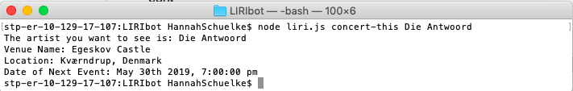

# LIRIbot

In this assignment I've created a LIRI, like iPhone's SIRI, but it is a Language Interpretation and Recognition Interface rather than a Speech Interpretation and Recognition Interface. LIRI is a command line node app that takes in parameters and gives you back data. Data returned will come from Spotify for songs, Bands in Town for concerts, and OMDB for movies.

This is a Javascript/jQuery/API/nodeJS project for the UMN Coding Bootcamp, assignment 8. 

## Getting Started

To utilize this project, I access my LIRIbot files via my terminal. From there, I can search for songs, concerts, and movies via using node commands as "concert-this", "spotify-this-song", "movie-this", and "do-what-it-says".


### Prerequisites

If you would like to utilize my project, you must first do an npm install. You must also clone the files from my Github repository "liri-node-app" [link below] and source your own API keys to put in an .env file, all within the same folder. 

### Installing

1. Direct yourself to the folder where you'd like to test my project. 
2. Do an NPM install. 
3. Go to https://github.com/HannahSchuelke/liri-node-app and clone my files into the same folder.
4. Make a .gitignore file and type "node_modules" ".DS_Store" ".env" into it. 
5. Source your own Spotify API key and insert that in your .env file. 
6. Open up your terminal and direct yourself to the folder where you have rooted my project. 
7. From here you may find information by typing "node liri.js *function* *search string*"

### How to use

The functions "concert-this", "spotify-this-song", "movie-this", and "do-what-it-says" will make an API call about your search string. If you do not enter an artist, my default search will return to you information about my favorites. The search strings do not need to be inside of quotes and can be multiple words. 

"concert-this" searches the Bands in Town Artist Events API, and returns the name of the artist you searched and information about their next concert: the name of the venue, the city and country of the venue, and the date and time of that show.  

!


```
Give an example
```

```
Give an example
```

## Deployment

Add additional notes about how to deploy this on a live system

## Built With

* [Dropwizard](http://www.dropwizard.io/1.0.2/docs/) - The web framework used
* [Maven](https://maven.apache.org/) - Dependency Management
* [ROME](https://rometools.github.io/rome/) - Used to generate RSS Feeds

## Contributing

Please read [CONTRIBUTING.md](https://gist.github.com/PurpleBooth/b24679402957c63ec426) for details on our code of conduct, and the process for submitting pull requests to us.

## Versioning

We use [SemVer](http://semver.org/) for versioning. For the versions available, see the [tags on this repository](https://github.com/your/project/tags). 

## Authors

* **Hannah Schuelke** - (https://github.com/HannahSchuelke)
